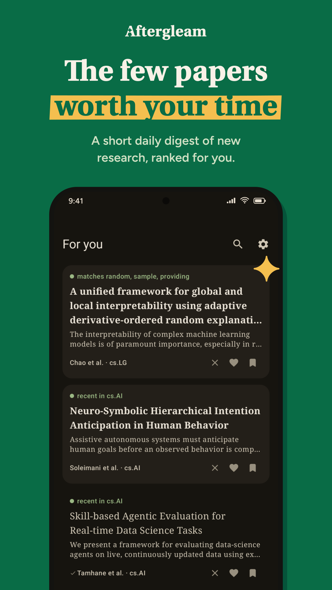
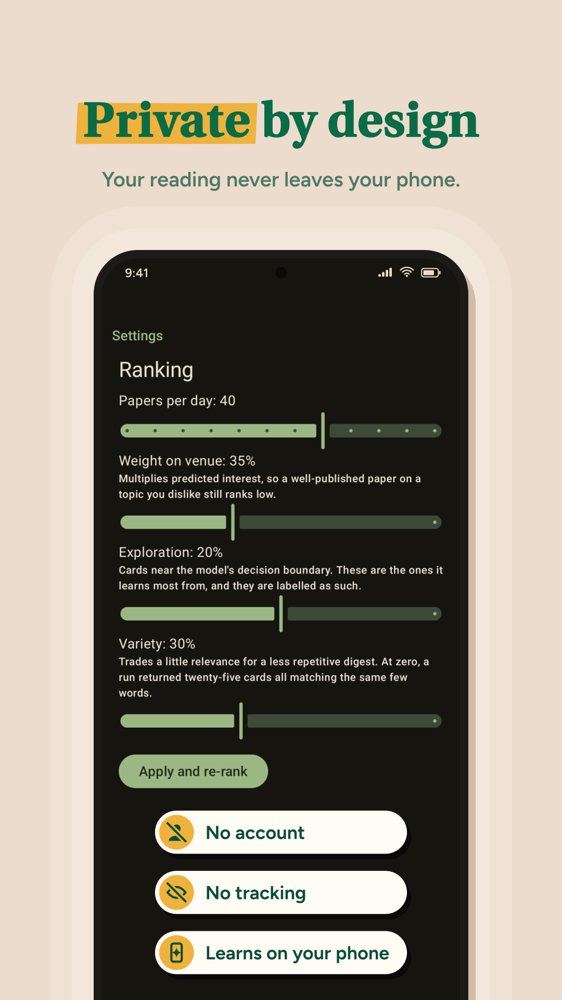
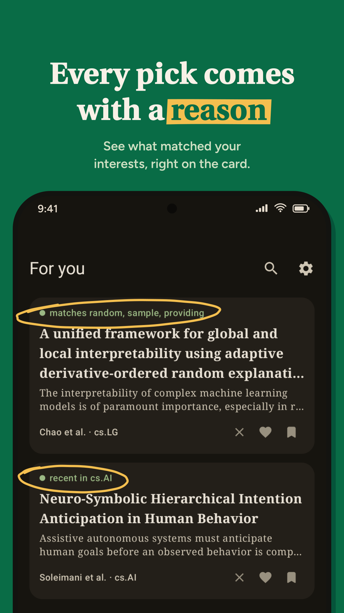
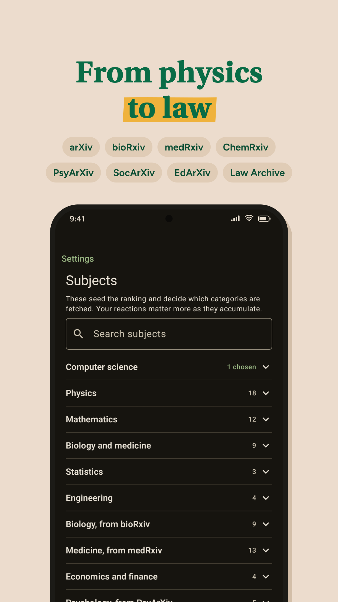
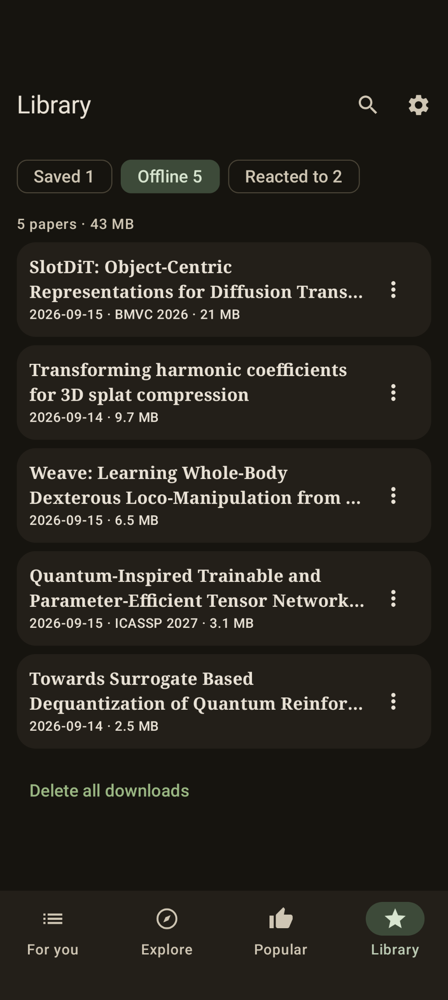
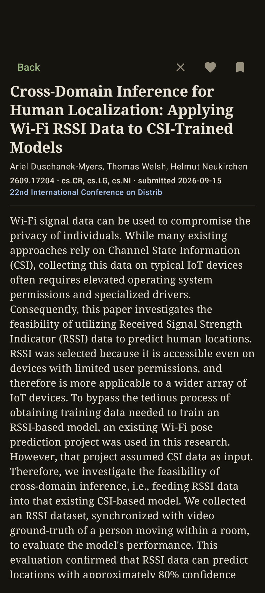

<p align="center">
  
</p>

# Aftergleam

A private reader for new research papers, ranked on your phone.

**[aftergleam.app](https://aftergleam.app)**

Hundreds of new papers appear every day. Aftergleam reads them and shows you the few worth
your time. It learns what you like from how you react, and the model is trained on your
device. There is no account and nothing about your reading leaves your phone.

<p align="center">
  
  
  
  
  
  
</p>

## Features

- A short daily digest, ranked for you, with the reason each paper was picked
- Explore, for papers just outside your usual reading
- Popular, for what other people are reading
- Read PDFs in the app and keep them offline
- Search, save, and import a BibTeX or RIS library from Zotero
- Export and restore your reading history as a plain file

## Sources

| Field | Server |
|---|---|
| Physics, mathematics, computer science, statistics, economics | arXiv |
| Biology and medicine | bioRxiv, medRxiv |
| Psychology, social science, education | PsyArXiv, SocArXiv, EdArXiv |
| Law | Law Archive |
| Chemistry | ChemRxiv |

Only the servers your subjects need are contacted.

## Privacy

No analytics, no ads, no account, and no server of our own. Your reactions, your reading
history and the model stay on your device. Fetching papers means asking the servers above for
them, so those servers see the requests. [PRIVACY.md](PRIVACY.md) lists exactly what is sent.

## Building

```sh
cd android
./gradlew assembleDebug
```

Any JDK 17 or newer will do. See [docs/development.md](docs/development.md) for tests, release
signing and the reasoning behind the design.

## Support

Aftergleam is free, with no ads and nothing to sell. If it is useful to you, you can support
it on [Ko-fi](https://ko-fi.com/jakobk).

## License

[GNU General Public License v3.0 or later](LICENSE).
